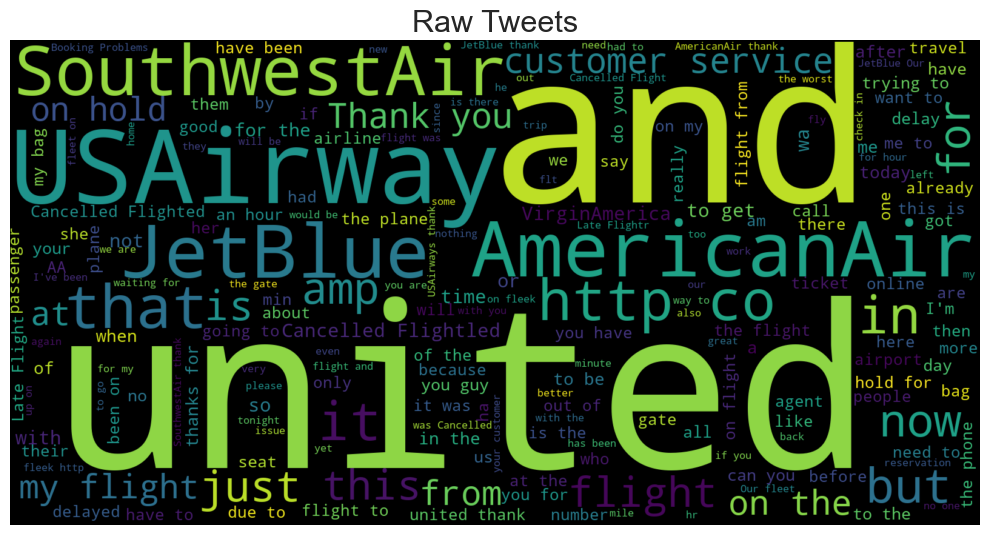
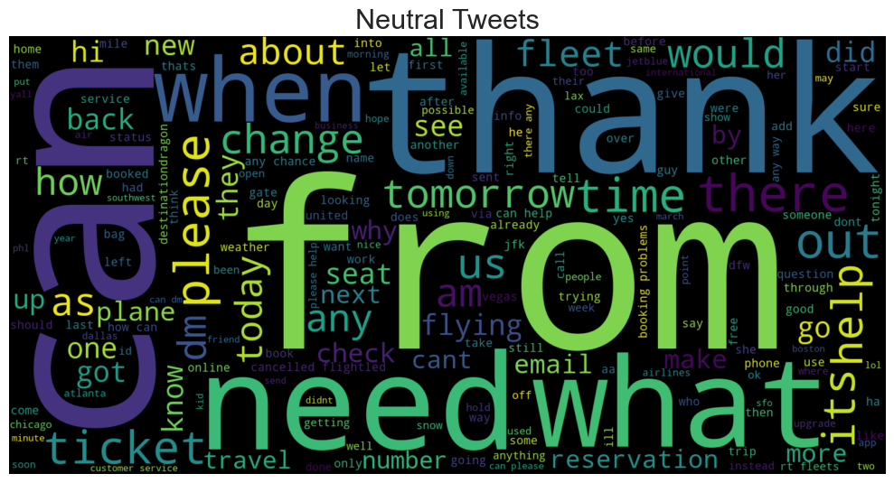
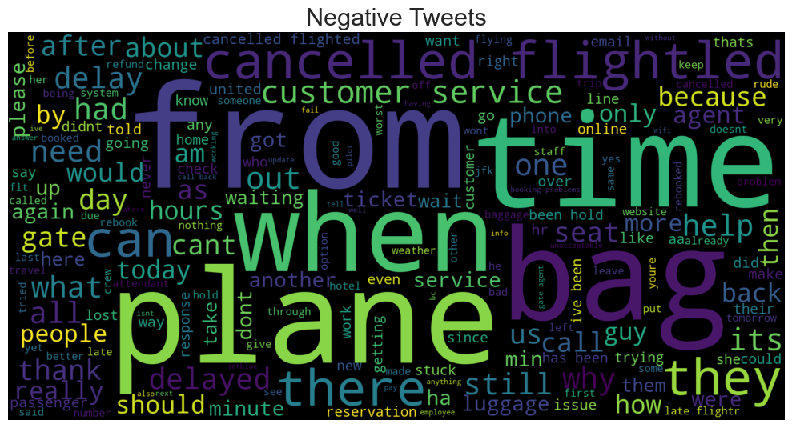
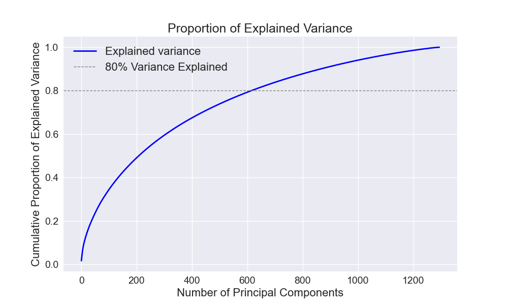
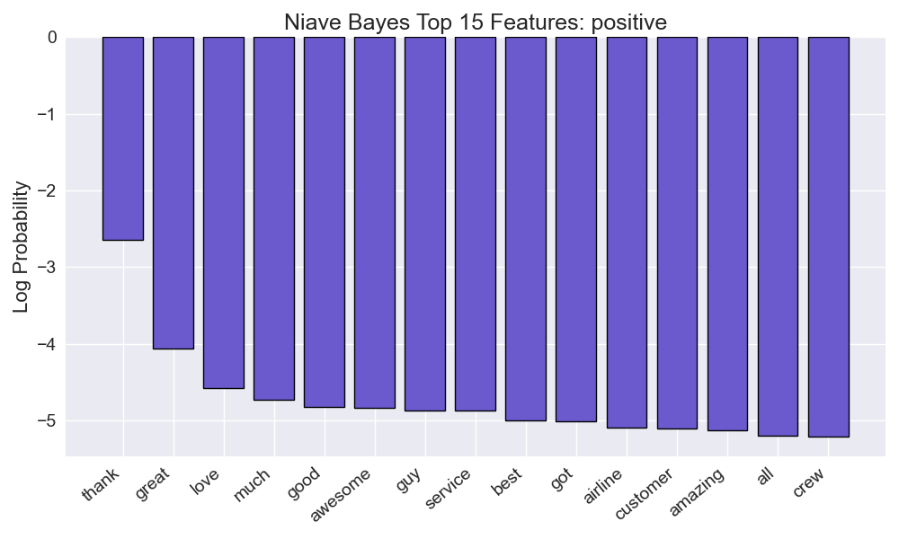
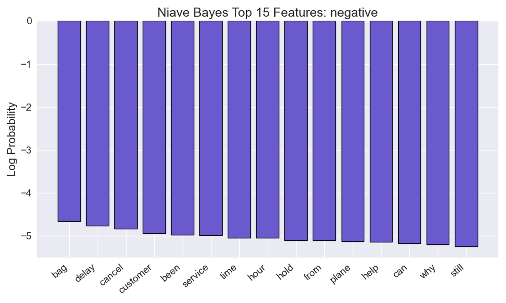

<div style="text-align: right"> Photo Courtesy of Ross Parmly </div>
<br>
<br>
<a href='http://ec2-18-216-91-220.us-east-2.compute.amazonaws.com:8080'>If you are looking for the demo of this project, click here!</a>

# Table of Contents
- [Airline Tweet Sentiment Analysis and Classification (NLP)](#airline-tweet-sentiment-analysis-and-classification--nlp-)
  * [Raw Data](#raw-data)
    + [Challenges](#challenges)
  * [Data Cleaning](#data-cleaning)
    + [User Standardization](#user-standardization)
  * [Exploratory Data Analysis](#exploratory-data-analysis)
    + [Sentiment Confidence](#sentiment-confidence)
    + [Sentiment Distribution](#sentiment-distribution)
    + [Principal Component Analysis](#principal-component-analysis)
  * [Text Processing](#text-processing)
    + [Text Featurization](#text-featurization)
  * [Models](#models)
    + [Naive Bayes](#naive-bayes)
      - [Naive Bayes Confusion Matrix](#naive-bayes-confusion-matrix)
    + [Random Forest (TF-IDF)](#random-forest-tf-idf)
      - [Random Forest Confusion Matrix (TF-IDF)](#random-forest-confusion-matrix-tf-idf)
    + [Random Forest (Doc2Vec)](#random-forest-doc2vec)
      - [Random Forest Confusion Matrix (Doc2Vec)](#random-forest-confusion-matrix-doc2vec)
    + [VADER Sentiment Analysis](#vader-sentiment-analysis)
      - [VADER Sentiment Analysis Confusion Matrix](#vader-sentiment-analysis-confusion-matrix)
    + [Model Assembly](#model-assembly)
    + [Final Results](#final-results)
      - [Final Ensemble Model Confusion Matrix:](#final-ensemble-model-confusion-matrix)
  * [Conclusions](#conclusions)
    + [Future Ideas](#future-ideas)
    + [Sources](#sources)
<small><i><a href='http://ecotrust-canada.github.io/markdown-toc/'>Table of contents generated with markdown-toc</a></i></small>

# Airline Tweet Sentiment Analysis and Classification (NLP)
This project uses a combination of supervised and rules-based models in order to predict tweet sentiment. For the purposes of this project, sentiment is classified as either `positive`, `negative`, or `neutral`.

Throughout this document, we will refer to two things found commonly in social media text data, `tags` and `hashtags`.

*Tags* are when a user has addressed another account in their tweet. 
Ex.
```
"@united thanks for the great service!".
```

A *hashtag* is a tool used in order to track trending topics throughout a social media platform, but is often simply used as a way for users to summarize their tweet in a few words.
Ex.
```
"This flight is still hasn't taken off!! #imsobored"
```

## Goals
1. Develop a model that can correctly predict the sentiment of a tweet aimed at an airline, with the specific goal of identifying negative tweets. A company could use this model to develop a program that automatically responds to negative tweets, directs customers to the appropriate department, or possibly sends these customers a promotion/discount before they result in negative PR or churn.

1. Compare the performance of pre-built rules-based sentiment classifiers with a model trained on tweets specific to a particular industry.

## Raw Data

[The dataset](https://www.kaggle.com/crowdflower/twitter-airline-sentiment) was sourced from kaggle and consists of ~14,000 tweets aimed at various airlines.

Each of row of data has the following information associated:
* airline : The airline the tweet was aimed at
* text : The content of the tweet
* airline_sentiment : The labelled sentiment of the tweet
* airline_sentiment_confidence : A confidence metric associated with the sentiment classification

Note, there are more fields than listed above, but for this purposes of this project, these were the only fields that were used from the original dataset.

Below are some raw sample tweets from the dataset:
```
"@VirginAmerica it was amazing, and arrived an hour early. You're too good to me."
```
```
"@united airlines delayed our flight on the way to Chicago and leaving Chicago. Next time @Delta it is."
```
```
"@southwestair continues to prove to be the best airlines 💪"
```
```
"@AmericanAir I really want to get home. Tonight, preferably. Please stop delaying my plane 😢😕😦 #AmericanAirlines"
```
```
"@VirginAmerica had to change to another airline to get to DC today ... Why is @united able to land in DC but not you? Cost me $800 ...ugh"
```

Before any processing, I separated a holdout set consisting of 25% of my total data for final model evaluation.

Below is a wordcloud of the raw data with no processing aside from removing punctuation:



Our most common words are all (unsurprisingly) associated with the Twitter accounts of various airlines. (Ex. @SoutwestAir, @united, etc.).

In addition to tagged users, there were also a variety of unicode characters included in tweets. Below are the unicode characters and punctuation I kept:

```
👏	😍	😄	😈	🌟	🌞	)	💤	😓	💺	
👸	😥	😵	☕	😡	⭐	&	👉	​	👀	
☀	😞	?	😱	️	💖	🎀	✨	🐴	😒	
👎	😅	{	|	.	~	💯	💔	😊	😜	
🌏	😬	➡	👍	🌴	😳	👺	💁	📱	🇬	
😫	;	🆖	💩	😆	…	🍸	👿	[	🍅	
_	🇺	😣	😕	📲	:	#	♥	🙏	😁	
-	🍷	🚪	@	😦	😤	🇧	💪	€	🚫	
😖	🆘	😐	✌	💗	😭	💙	(	"	\	
🍻	🙌	😑	😷	😠	💜	😂	😢	😔	%	
😎	°	✈	😻	✔	🐩	😏	😉	❗	⌚	
😮	!	$	🐳	^	,	😀	👊	🇸	💕	
🎵	=	]	❤	⛄	✅	🔵	£	+	}	
❌	😪	↔	😘	🙅	👠	😃	😲	*	👋	
👌	😩	—	💝	'	☺	🎉	–	❄	😋	
🎲	/	
```

### Challenges
* Emojis often break programs not designed to handle them
* The nature of Twitter makes the data very prone to misspellings
* Tagged users and hashtags can be hard to interpret due to lack of spaces
* Some incorrectly labelled sentiments
* The frequency of tagged airlines will surely affect any NLP we try to do

## Data Cleaning

To clean the data, the following was implemented:
1. Making everything lowercase
1. Removed links/URLs
1. Removed hashtag symbols, but kept the text
1. Trimming whitespace/line breaks
1. Removed unhelpful unicode symbols (ex. "⤴", "⤵", etc.)
1. Removed stop words (ex. 'my', 'is', 'in', 'it', 'no', 'of', 'not', 'your', 'me', 'hour', 'have', etc.)

### User Standardization
In addition to the above, an effort was made to standardize all tagged Twitter accounts mentioned in tweets. Since most every tweet had at least one user tagged, the goal of this transformation was to refeaturize the words that cluttered the data into something more useful. With this transformation, we have essentially replaced 1000+ features with 3:
1. @airlineaccount - Was the airline in question tagged in the tweet?
1. @otherairlineaccount - Was another airline tagged in the tweet?
1. @useraccount - Was an account unrelated to airlines tagged in the tweet?

For example:
```
"@VirginAmerica had to change to another airline to get to DC today ... Why is @united able to land in DC but not you? Cost me $800 ...ugh"
```
Was transformed to:
```
"@airlineaccount had to change to another airline to get to DC today ... Why is @otherairlineaccount able to land in DC but not you? Cost me $800 ...ugh"
```

After this transformation (and adding those three accounts to a stopwords list), we were left with the following wordcloud.


This wordcloud is a bit more promising, as we start to see words that will be more predictive of sentiment have become more relevant (such as: 'thank', 'bag', 'service', 'time', etc.)

## Exploratory Data Analysis

### Sentiment Confidence
One of the fields we had from the raw data was `airline_sentiment_confidence` (a confidence level associated with each sentiment label).

Below is a distribution of these confidences.


After a bit of exploration, I found those tweets in the lower confidence (> 50%) levels were often labelled inaccurately, so they were dropped from the dataset.

### Sentiment Distribution
After considering data with greater than 50% confidence on the labelling, we had the following distributions of sentiments:


We can see that negative tweets are the largest sentiment class (followed by neutral and then positive). This is unsurprising as generally, people go to Twitter to express their frustrations more often than leave positive feedback.

Grouped by airline, the sentiments looked like this:


We see that **United** is most represented in the dataset, with **Virgin America** being the least represented. If we look at this same data as proportions, we see the following:


Here we see that **US Airways** has the highest proportion of negative tweets, while Virgin America has the highest proportion of positive tweets (nearly equal across all three classes)

Inside of each of these classes, we see the following WordClouds for each sentiment:
 
 


For positive tweets, we see some promising words, such as "thank", "great", "awesome", "best", and "love".

For negative tweets, we see equally descriptive words, such as "bag", "cancelled", "delay", and "time".

Neutral tweets look a bit less descriptive, containing a lot of words found in other classes.

### Principal Component Analysis
In effort to get a clearer idea of how the data is distributed, I used PCA with three components simply with the goal of visualizing the data in comprehendable dimensions. This process informed the [User Standardization](#User-Standardization) transformation.

The first animation are three components before transforming/standardizing the users. The transformation's benefit can be seen in the lower animation.

Again, positive tweets are green, negative tweets are red, and neutral tweets are yellow.

 


Although there is still a lot of overlap between the sentiment classes, it certainly looks better in the second animation. Essentially, the first analysis was forming clusters simply based on the tagged airline, with little hope for finding structure aligning with the tweet sentiment.

It is worth noting that three principal components only accounts for a small proportion (< 5%) of the variance seen in the data.



In order to account for 80% of the variance in the data, we'd need ~600 principal components. This ruled out using these principal components as features for predictions

## Text Processing
To vecotize the tweet data before attempting to fit any models, I used a TF-IDF, CountVectorizer, and a Doc2Vec transofrmation with a custom lemmatizer. This lemmatizer was a combination of WordNet from SKLearn and a custom dictionary built to handle words specific to this dataset.

```python3
additional_lemmatize_dict = {
    "cancelled": "cancel",
    "cancellation": "cancel",
    "cancellations": "cancel",
    "delays": "delay",
    "delayed": "delay",
    "baggage": "bag",
    "bags": "bag",
    "luggage": "bag",
    "dms": "dm",
    "thanks": "thank"
}
```

### Text Featurization
I looked at two different schools of thought to featurize the text.
1. Bag of Words
1. Continuous Bag of Words

For bag of words, I used two specific methods of vectorizing the text documents, the standard count vectorizer and a a TF-IDF matrix. 

Below is an example of a count vectorizer. 
<center>
  
</center>

In this simple example, we convert the string `"@southwestair continues to prove to be the best airlines 💪"` to the vector `[1, 1, 2, 1, 1, 1, 1, 1, 1] `.

A flaw in this approach is that it naively assumes each word has no relationship to the words around it.
* Ex, "man bites dog" and "dog bites man" are represented **exactly the same** with a bag of words

<br>
<br>

A **Continuous Bag of Words** approach is much more complex. It utilizes a word's *context* to vectorize it. It does this by training a single layer perceptron on the context of a word (as defined by a `window` parameter), with the ouput as the **focus word**. The weights from this single layer are then used as the word vector. Below is a simple example of a Continuous Bag of Words model called `Word2Vec`.

<center>
  
</center>

In this simple example, we convert the word `"best"` to the vector `[-0.4, 1.2, 0.7, 1.1, -1.5] `. Unlike the traditional  bag of words approach, the vector resulting from a continuous bag of words contains information regarding a word's **context**.

Below we can see the difference these two different types of text featurizing can make using the same principal component analysis as before.


## Models

Models were tuned and evaluated based on their macro-averaged F1-Score. I chose this metric over accuracy due to my unbalanced classes. If we were to simply predict the majority class (negative) for every tweet, we would get a baseline accuracy of `0.61`, but an F1-Score of `0.25`.

### Naive Bayes

Using a MultiNomial Naive Bayes classifier model, I was able to get pretty good results, with an accuracy of `0.74` and an F1-Score of `0.62` against the holdout data.

Using this model, I was able to see the top features (words) associated with each predicted sentiment.

 
 


We get similar features as we saw before with the early wordclouds (aside from the addition of the transformed users). For positive sentiment, we see `thank`, `great`, `awesome`, and other positively associated words. 

For neutral sentiment, we see some words like `please`, `what`, and `when`; indicating many tweets in this class were questions asked of the airlines by twitter users, not necessarily positive or negative.

For negative sentiment, we see similar words as before; `bag`, `delay`, and `cancel`. We also see that the transformed user accounts are pretty informative for this class. We see that `otherairlineaccount` is the most important feature for this class. This means that if a user tags a different airline in addition to the airline being tweeted at, it is likely (high log probability) a complaint or a negative tweet.


#### Naive Bayes Confusion Matrix
|               |   pred:negative |   pred:neutral |   pred:positive |
|:--------------|----------------:|---------------:|----------------:|
| true:negative |            2174 |             45 |              23 |
| true:neutral  |             546 |            246 |              38 |
| true:positive |             283 |             30 |             275 |

### Random Forest (TF-IDF)

The Random Forest was the best performing model that I tried, with an accuracy `0.78` and an F1-Score of `0.73` against the holdout data.

The following chart shows the number of estimators (trees) used in the Random Forest vs F1-Score.


After examining this chart, I saw little difference beyond 250 estimators, so I continued with that parameter for the Random Forest. Doing so gave me the following top features


Since I found trimming down my features only hurt my model performance, it is no surprise all my feature importances are so low, but again, we see some familiar tokens, such as `thanks`, `!`, `?`, `awesome`, `great`, `delay`, `cancel`.

#### Random Forest Confusion Matrix (TF-IDF)
|               |   pred:negative |   pred:neutral |   pred:positive |
|:--------------|----------------:|---------------:|----------------:|
| true:negative |            1956 |            207 |              79 |
| true:neutral  |             272 |            493 |              65 |
| true:positive |             131 |             86 |             371 |


### Random Forest (Doc2Vec)
Running the same Random Forest Classifier on the text featurized using `Doc2Vec` yielded surprisingly similar results, despite the models being trained on very different data. This was surprising to me, as I expected the Doc2Vec featurized data to have much stronger predictability. I attribute this to my documents' length (Tweets are limited to 280 characters), as well as the the general size of my dataset (~14,000 is a bit short).

The Doc2Vec featurized Random Forest was better at predicting both Positive and Negative sentiments, but performed worse than the traditional TF-IDF featurized Random Forest when it came to predicting neutral sentiment.

This model had an accuracy of `0.78` and an F1-Score of `0.73` against the holdout data.

#### Random Forest Confusion Matrix (Doc2Vec)
|               |   pred:negative |   pred:neutral |   pred:positive |
|:--------------|----------------:|---------------:|----------------:|
| true:negative |            1967 |            175 |             100 |
| true:neutral  |             286 |            469 |              75 |
| true:positive |              94 |             69 |             425 |

### VADER Sentiment Analysis

VADER Sentiment Analysis was the only rules-based technique I used in my modelling. VADER is a complicated algorithm that is able to derive sentiment from sentence structure, punctuation, emojis, and much more.

Essentially, if you give it a sentence, it will return a score associated with a positive sentiment, neutral sentiment, and negative sentiment. Luckily these are the same classes we are attempting to predict!

For example:
```python
demo_vader("This airline stinks!")
>>> {'neg': 0.534, 'neu': 0.466, 'pos': 0.0, 'compound': -0.3164}

demo_vader("this airline is usually good, but this time they lost my bags :(") 
>>> {'neg': 0.363, 'neu': 0.533, 'pos': 0.104, 'compound': -0.705}
```

This model performed the worst out of my three models, with an accuracy of `0.55` (~0.06 less than guessing the majority class for every prediction), and an F1-Score of `0.52` (~0.27 higher than the baseline).

#### VADER Sentiment Analysis Confusion Matrix

|               |   pred:negative |   pred:neutral |   pred:positive |
|:--------------|----------------:|---------------:|----------------:|
| true:negative |            1143 |            403 |             696 |
| true:neutral  |             117 |            354 |             359 |
| true:positive |              25 |             56 |             507 |


### Model Assembly

I tried a few methods of combining these three models with varying success. The two main methods I tried were a **probability** based, and a **voting** based system.

Overall, I found the **probability** based system outperformed the voting system. By taking all of the predicted probabilities from all four of my models, applying some weights (weights were determined through brute force), taking the sum of the weighted probabilities, and finally predicting the class with the maximum probability.

<center>
  
</center>

This ensemble model ended up being my top performing model, with an accuracy of `0.80` and an F1-Score of `0.76`.

### Final Results

| Model         	| F1-Score (macro) 	| Accuracy 	|
|---------------	|------------------	|----------	|
| Baseline      	| 0.25             	| 0.61     	|
| Naive Bayes   	| 0.61             	| 0.74     	|
| Random Forest (TF-IDF) 	| 0.73             	| 0.78     	|
| Random Forest (Doc2Vec) 	| 0.73             	| 0.78     	|
| VADER         	| 0.52             	| 0.55     	|
| **Ensemble Model** 	| **0.76**             	| **0.80**     	|

#### Final Ensemble Model Confusion Matrix:

|               |   pred:negative |   pred:neutral |   pred:positive |
|:--------------|----------------:|---------------:|----------------:|
| true:negative |            1980 |            200 |              62 |
| true:neutral  |             230 |            545 |              55 |
| true:positive |              95 |             67 |             426 |


## Conclusions

The Random Forest was by far the best-performing standalone model I implemented on this dataset.

Although the Doc2Vec featurized text did not outperform the same model trained on a traditional bag of words, the combination of these models ended up working quite well. Since the data was featurized entirely differently, each random forest was able to make up for the shortcomings of the other. 

Although I was surprised to see the Doc2Vec featurized text perform about the same as the same model trained on a bag of words, I attribute the similarity to the general size of my documents (280 character limit), and the size of my dataset (14,000 documents).

Despite VADER scoring a lower in accuracy than the baseline of just guessing the majority class for each prediction, it ended up positively contributing to the combined model, even when given a vote equal to that of the Random Forest and Naive Bayes (two models that were significantly better performers on their own). 

The combination of models ended up performing better than any of the standalone models.

To recreate this analysis, see [src/README.md](src/README.md).

### Future Ideas
Things I would like to implement in the future:
* Implement an RNN or CNN and compare performance
* Use GridSearchCV to better tune parameters of existing models
* Try TextBlob or IBM Watson instead of VADER and compare performance
* Featurize data in other ways (ex. number of emojis, number of all-caps words)
* Try to standardize spellings of commonly mispelled words (thx, sux, etc.)
* Get more data!

### Sources
* https://www.kaggle.com/crowdflower/twitter-airline-sentiment
* https://unsplash.com/photos/rf6ywHVkrlY
